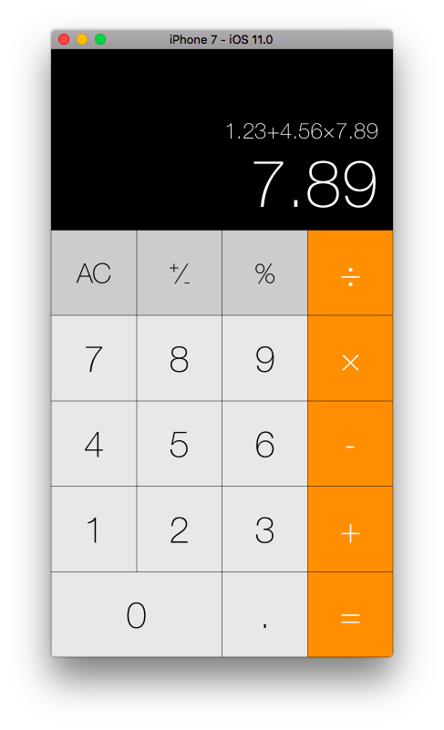

# iOS 10 Calculator Implementation
## Introduction
Continue the calculator app started in class. Add the necessary buttons and the logic necessary to implement the following operations: +, -, ×, ÷, +/-, %, AC, . (decimal point).
## Features
There are several points I did that was not required by the original assignment:
- The layout highly imitated the original iOS 10 Calculator app.
- This app works on most versions of iPhones from 5 to 7 Plus.
- Added a field that shows the input stack (to avoid forgetting what was input).
## Notes
- The feature "-/+ should not change the display for the number 0" from the assignment requirement is not consistent with real iPhone calculators (line 117, 123-126)
- "C" not implemented
- The mechanism of the "%" operator is different from the built-in calculator. (The mechanism of the iOS calculator even differs from the Mac OSX calculator.)
- Functions in landscape orientation not implemented
- Views on landscape orientation and iPad or iPhone 4s disordered
## Tests (requirements)
- Prevent the user from adding multiple decimal points in a number (e.g., user shouldn’t be able to enter “0.12321.121.11”).
- When the calculator starts up it should display the number 0, pressing 0 multiple times should not change the display.
- The button +/- should not change the display for the number 0.
- Your calculator should be able to re-apply the same operation multiple times. So if the user hits the following sequence of keys “7”, “+”, “1”, “=”, “=”, “=”, the final result should be 10. The same applies to any of the binary operations.
## Preview

